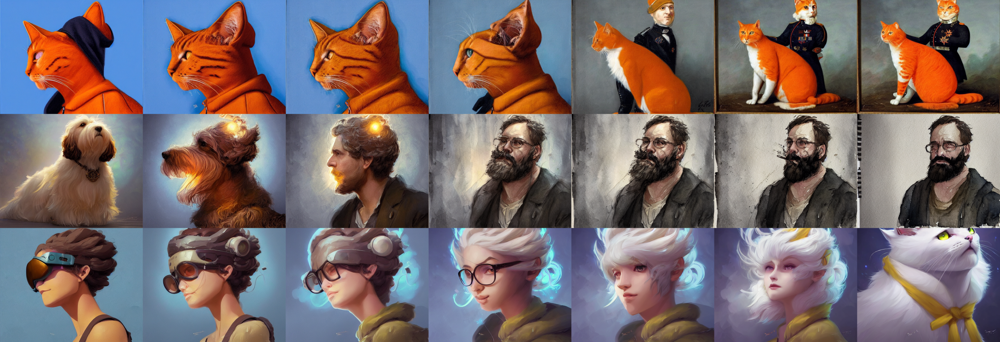
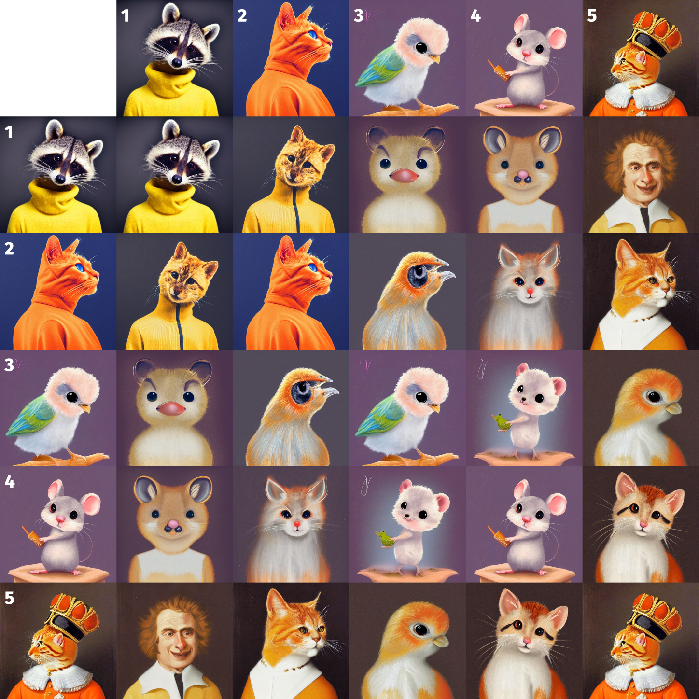

# stablediffusion-interpolation-tools

This repo has tools to interpolate between prompts for Stable Diffusion models. It can generate pictures like the ones below (pairwise matrix and multiple steps) as well as videos.

